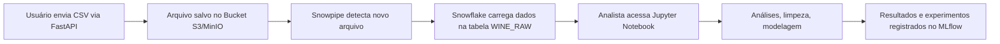

# 📊 Projeto: Análise e Visualização de Dados — 2025.2  
**CESAR School**

---

## 🧭 1. Introdução e Objetivos

Este projeto foi desenvolvido como parte da disciplina **Análise e Visualização de Dados (2025.2)** da CESAR School.

O objetivo é construir uma pipeline moderna que permita:

- Ingerir dados a partir de arquivos CSV enviados via **FastAPI**
- Armazenar e versionar os arquivos em um **bucket S3**
- Carregar automaticamente para o **Snowflake via Snowpipe**
- Analisar, tratar e modelar os dados em **Jupyter Notebooks**
- Visualizar insights por meio de dashboards/notebooks

---

## 🏗️ 2. Arquitetura e Ferramentas Utilizadas

A solução utiliza uma arquitetura containerizada com **Docker Compose**, integrando diferentes componentes.

### 2.1 Componentes Principais

| Componente     | Função |
|----------------|--------|
| **FastAPI** | Endpoint para upload de CSVs |
| **AWS S3 / MinIO** | Armazenamento dos arquivos CSV (Data Lake) |
| **Snowflake** | Ingestão automática via Snowpipe |
| **Jupyter Notebook** | Análise exploratória, limpeza, modelagem |
| **MLflow** | Rastreamento de experimentos |
| **MySQL** | Backend para o MLflow |
| **Docker Compose** | Orquestração dos serviços |

---

### 2.2 Fluxo Arquitetural



## 🔬 3. Metodologia de Tratamento e Modelagem de Dados

Fluxo inspirado em **CRISP-DM**.

### 3.1 Entendimento dos Dados
- Dados CSV com atributos numéricos  
- Ingestão para **WINE_RAW** (Snowflake)

### 3.2 Qualidade e Limpeza
- Conversão de tipos  
- Tratamento de inconsistências  
- Valores ausentes  
- Duplicidades (mantidas quando justificadas)

### 3.3 Transformações
- Colunas derivadas  
- Filtragem e reorganização  
- Padronização de variáveis

### 3.4 Modelagem
- Experimentos no Jupyter  
- Rastreamento com MLflow  


---

## 📈 4. Análises e Resultados

### 4.1 Estatísticas Descritivas
- Média, mediana, desvio padrão  
- Distribuições

### 4.2 Visualizações
- Histogramas  
- Boxplots  
- Matriz de correlação  
- Gráficos de dispersão

### 4.3 Tabelas Relevantes
- Estatísticas globais  
- Correlações  
- Amostras tratadas  


---

## 📊 5. Dashboard e Insights Obtidos

Os dashboards permitem visualizar:

- Evolução das variáveis  
- Distribuições  
- Comparação entre variáveis  
- Fatores que influenciam a variável alvo  

**Exemplos de insights:**
- Identificação das features mais relevantes  
- Padrões detectados na análise exploratória  


---

## 🧪 6. Estrutura do Repositório
```
.
├── docker-compose.yml
├── fastapi_app/
├── jupyter_app/
├── mlflow_app/
├── data/
    └── raw/
├── scripts/
    └── pipeline.sh
```


---

## ⚙️ 7. Requisitos

- Docker  
- Git  
- Conta na AWS
- Conta no Snowflake  
- Arquivo `.env` configurado  

---

## 🚀 8. Como Executar o Projeto

Após realizar clone do projeto e dentro do diretório AVD_PROJECT_ARCHITECTURE, basta:

```bash
# execução completa + upload de dados
bash scripts/pipeline.sh --upload

# apenas subir containers
bash scripts/pipeline.sh
```

## 🌐 9. Endpoints e Interfaces

| Serviço          | URL                       |
|------------------|---------------------------|
| **FastAPI**      | http://localhost:8000     |
| **Jupyter**      | http://localhost:8888     |
| **MinIO Console**| http://localhost:9001     |
| **MLflow**       | http://localhost:5000     |

---

## 🧪 10. Testando o Upload via FastAPI

1. Coloque o arquivo CSV em `data/raw/`
2. Envie:

```bash
curl -X POST http://localhost:8000/upload
```

---

## 📝 11. Conclusões

O projeto demonstra:
- Integração entre FastAPI, S3, Snowflake, Jupyter e MLflow
- Automação da ingestão via Snowpipe
- Pipeline completa de análise e modelagem
- Estrutura profissional de engenharia de dados

---

## 🚀 12. Melhorias Futuras