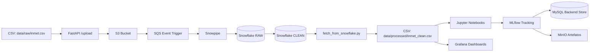

# Projeto: Pipeline de Ingestão, Processamento e Análise — Inmet + Snowflake + MLflow

## Visão Geral
Este repositório implementa uma arquitetura completa para ingestão, armazenamento, processamento e análise de dados meteorológicos do INMET.  
O fluxo principal é:

`data/raw/inmet.csv → FastAPI → S3 → SQS → Snowpipe → Snowflake (staging → clean) → data/processed/inmet_clean.csv`

Além disso, o ambiente de experimentação em Machine Learning utiliza:

`Jupyter → MLflow → MinIO (artefatos) → MySQL (backend store)`

A orquestração é feita com **Docker Compose**, e o script `pipeline.sh` automatiza todo o processo (upload, processamento e extração final).

---
## Estrutura do Repositório

```md
.
├── data
│   ├── processed/            # dados limpos exportados pelo Snowflake
│   └── raw/                  # arquivos CSV brutos para upload
│
├── fastapi_app/
│   ├── main.py               # endpoint POST /upload → envia CSV para S3
│   ├── Dockerfile
│   └── requirements.txt
│
├── grafana/
│   ├── dashboards/           # dashboards JSON provisionados automaticamente
│   │   └── inmet_chuva.json
│   └── provisioning/
│       ├── dashboards/       # config de provisionamento de dashboards
│       └── datasources/      # config de provisionamento de datasources
│
├── jupyter_app/
│   ├── notebooks/
│   │   ├── exploracao.ipynb
│   │   └── modelagem.ipynb
│   ├── Dockerfile
│   └── requirements.txt
│
├── mlflow_app/
│   ├── Dockerfile
│   └── requirements.txt
│
├── scripts/
│   ├── pipeline.sh           # script, facilitar uso da solução
│   └── fetch_from_snowflake.py
│
├── docker-compose.yml
└── README.md


```

---

## Organização e Documentação
- **README.md**: orientar a execução e arquitetura do projeto.
- **data/raw**: arquivos brutos que serão enviados à API.
- **data/processed**: saída final extraída do Snowflake (camada clean).
- **scripts/**: automações de ingestão e extração.
- **grafana/**: dashboards e configurações de provisionamento do Grafana.
- **fastapi_app**, **jupyter_app**, **mlflow_app**, **etc**: todos os serviços foram isolados via Docker.

---

## Requisitos
- Docker 
- Conta Snowflake com Storage Integration configurado
- Bucket S3 configurado para Snowpipe
- Credenciais no arquivo `.env` na raiz

---

## Configuração do Ambiente (.env)

Crie um arquivo `.env` na raiz:

```env
# AWS
AWS_ACCESS_KEY_ID=
AWS_SECRET_ACCESS_KEY=
AWS_DEFAULT_REGION=
S3_BUCKET=
S3_PATH=

# Snowflake
SNOWFLAKE_USER=
SNOWFLAKE_PASSWORD=
SNOWFLAKE_ACCOUNT=
SNOWFLAKE_WAREHOUSE=
SNOWFLAKE_DATABASE=
SNOWFLAKE_SCHEMA=
SNOWFLAKE_TABLE=

# Minio
MINIO_ROOT_USER=
MINIO_ROOT_PASSWORD=
MINIO_ACCESS_KEY_ID=
MINIO_SECRET_ACCESS_KEY=

# MySQL
MYSQL_ROOT_PASSWORD=
MYSQL_DATABASE=
MYSQL_USER=
MYSQL_PASSWORD=

# MlFlow endpint
MLFLOW_MINIO_ENDPOINT_URL=
MLFLOW_ARTIFACT_BUCKET=  
MLFLOW_BACKEND_URI=

````

**Importante:**

* Não comitar `.env`.
* Ajuste nomes de tabela e schema conforme seu S3 e Snowflake.

---

## Preparando os Dados (colocar CSV)

1. Adicione seu arquivo original na pasta:

   ```
   data/raw/inmet.csv
   ```

2. O FastAPI irá receber este arquivo e enviá-lo para o bucket S3.

---

## Executando a Pipeline

### 1) Executar o script principal

Toda a automação do pipeline é feita pelo script `pipeline.sh`.  
Na raiz do projeto, execute:

#### Com upload (FastAPI → S3 → Snowpipe → Snowflake → exportação):
```bash
bash scripts/pipeline.sh --upload
````

#### Sem upload (apenas inicializa os containers):

```bash
bash scripts/pipeline.sh
```

---

## O que o script faz

O `pipeline.sh` é responsável por:

1. **Subir todos os containers** utilizando `docker compose up -d`
2. **Validar a existência do arquivo `.env`** na raiz do projeto
3. Quando executado com `--upload`:

   * Aguarda o FastAPI iniciar (10s)
   * Envia o arquivo CSV presente em `data/raw/` para o FastAPI
     → o FastAPI encaminha o arquivo para o S3
   * Aguarda o Snowpipe processar o arquivo (10s)
     → arquivo carregado na camada **RAW**
     → Snowflake aplica o tratamento e gera a tabela **CLEAN**
   * Executa `fetch_from_snowflake.py` dentro do container `jupyter`
     → salva o resultado final em:

     ```
     data/processed/inmet_clean.csv
     ```
4. Quando executado **sem** `--upload`:

   * Sobe containers
   * Não envia novos arquivos
   * Não executa o fetch automaticamente

Ao final, o script finaliza com:

```
[DONE] Pipeline concluído!
```


## Script `fetch_from_snowflake.py`

Este script também utilizado pelo `pipeline.sh`:

* conecta ao Snowflake via credenciais do `.env`;
* lê a tabela `<SNOWFLAKE_TABLE_CLEAN>`;
* salva em:

```
data/processed/inmet_clean.csv
```

---

## Arquitetura (Mermaid)



---

## Grafana — Visualização de Dados

O projeto inclui o **Grafana** para visualização dos dados meteorológicos com dashboards pré-configurados.

### Estrutura do Grafana

```md
grafana/
├── dashboards/
│   └── inmet_chuva.json        # Dashboard de classificação de intensidade da chuva
└── provisioning/
    ├── dashboards/
    │   └── dashboards.yaml     # Configuração de provisionamento de dashboards
    └── datasources/
        └── infinity.yaml       # Configuração do datasource Infinity
```

### Plugins Necessários

Os seguintes plugins são necessários para o dashboard funcionar corretamente:

| Plugin | ID do Plugin | Descrição |
|--------|--------------|-----------|
| **Infinity** | `yesoreyeram-infinity-datasource` | Datasource para consumir dados de APIs REST, CSV, JSON, GraphQL, etc. |
| **Business Charts** | `volkovlabs-echarts-panel` | Painel Apache ECharts para visualizações avançadas |
| **HTML Graphics** | `gapit-htmlgraphics-panel` | Painel para criar visualizações customizadas com HTML/CSS/JS |

#### Configurando os Plugins no Docker Compose

Verifique se a variável `GF_INSTALL_PLUGINS` no serviço `grafana` do `docker-compose.yml` contém todos os plugins:

```yaml
environment:
  - GF_INSTALL_PLUGINS=yesoreyeram-infinity-datasource,volkovlabs-echarts-panel,gapit-htmlgraphics-panel
```

> **Nota:** Se algum plugin estiver faltando, adicione-o à lista separando por vírgula.

### Acessando o Grafana

1. **Inicie os containers:**
   ```bash
   docker compose up -d
   ```

2. **Acesse o Grafana:**
   - URL: [http://localhost:3000](http://localhost:3000)
   - **Usuário padrão:** `admin`
   - **Senha padrão:** `admin`

3. O dashboard **"Classificação da Intensidade da Chuva"** estará disponível automaticamente na seção de Dashboards.

### Provisionamento Automático

O Grafana está configurado com **provisionamento automático**, ou seja:

- ✅ **Datasources** são criados automaticamente ao iniciar
- ✅ **Dashboards** são importados automaticamente ao iniciar
- ✅ **Plugins** são instalados automaticamente ao iniciar

> **Nota:** O dashboard consome dados de um arquivo CSV hospedado no GitHub. Certifique-se de que o arquivo `data/clean/inmet_clean.csv` esteja disponível na branch `develop` do repositório.

### Configuração Manual do Datasource (Fallback)

Caso o provisionamento automático do datasource não funcione, siga os passos abaixo para configurá-lo manualmente:

1. **Acesse o Grafana** em [http://localhost:3000](http://localhost:3000)

2. **Vá em Connections → Data sources → Add data source**

3. **Busque por "Infinity"** e selecione o plugin

4. **Configure o datasource com os seguintes valores:**

   | Campo | Valor |
   |-------|-------|
   | **Name** | `Infinity CSV INMET` |
   | **UID** | `ef5ezkch2esxse` |

   > ⚠️ **Importante:** O UID deve ser exatamente `ef5ezkch2esxse` para que o dashboard funcione corretamente.

5. Em **Authentication**, deixe como **No Authentication**

6. Clique em **Save & Test**

7. **Recarregue o dashboard** para que ele reconheça o datasource

### Verificando a Configuração dos Painéis (Troubleshooting)

Se os dados não aparecerem nos painéis do dashboard, verifique se cada painel está configurado corretamente:

1. **Edite o painel** (clique no painel → Edit)

2. **Verifique se a query está configurada assim:**

   | Campo | Valor |
   |-------|-------|
   | **Data source** | `yesoreyeram-infinity-datasource` (Infinity) |
   | **Type** | `CSV` |
   | **Parser** | `Backend` |
   | **Source** | `URL` |
   | **Format** | `Table` |
   | **Method** | `GET` |
   | **URL** | `https://raw.githubusercontent.com/mesa-6/avd-project/refs/heads/develop/data/clean/inmet_clean.csv` |

3. **Verifique a seção "Parsing options & Result fields"** para garantir que os campos estão mapeados corretamente

4. Clique em **Apply** para salvar as alterações

> **Dica:** Se o datasource não aparecer na lista, certifique-se de que o plugin **Infinity** está instalado e o datasource foi criado com o nome correto.

### Personalizando Dashboards

Para adicionar novos dashboards:

1. Crie ou exporte o dashboard em formato JSON
2. Salve o arquivo em `grafana/dashboards/`
3. Reinicie o container do Grafana:
   ```bash
   docker compose restart grafana
   ```

---

## Usando Grafana Cloud (Alternativa)

Se preferir usar o **Grafana Cloud** em vez do Grafana local via Docker, siga as instruções abaixo:

### 1. Criar uma conta no Grafana Cloud

1. Acesse [https://grafana.com/cloud](https://grafana.com/cloud)
2. Crie uma conta gratuita
3. Acesse sua instância (ex: `https://seu-usuario.grafana.net`)

### 2. Instalar os Plugins Necessários

1. Vá em **Administration → Plugins**
2. Busque e instale os seguintes plugins:

   | Plugin | Como buscar |
   |--------|-------------|
   | **Infinity** | Busque por "Infinity" |
   | **Business Charts** | Busque por "Business Charts" |
   | **HTML Graphics** | Busque por "HTML Graphics" |

### 3. Configurar o Datasource

1. Vá em **Connections → Data sources → Add data source**

2. Busque por **"Infinity"** e selecione

3. Configure com os seguintes valores:

   | Campo | Valor |
   |-------|-------|
   | **Name** | `Infinity CSV INMET` |
   | **UID** | `ef5ezkch2esxse` |

   > ⚠️ **Importante:** O UID **deve ser exatamente** `ef5ezkch2esxse` para que o dashboard funcione.

4. Em **Authentication**, selecione **No Authentication**

5. Clique em **Save & Test**

### 4. Importar o Dashboard

1. Vá em **Dashboards → New → Import**

2. Faça upload do arquivo `grafana/dashboards/inmet_chuva.json` do repositório

3. Selecione o datasource **"Infinity CSV INMET"** quando solicitado

4. Clique em **Import**

### 5. Verificar o Dashboard

O dashboard **"Classificação da Intensidade da Chuva"** deve estar funcionando e exibindo os dados do CSV hospedado no GitHub.

> **Nota:** No Grafana Cloud, você não precisa rodar o container do Grafana via Docker. Pode comentar ou remover o serviço `grafana` do `docker-compose.yml` se desejar.

---

## Observações sobre Docker

* Todos os serviços são isolados.
* O projeto é reproduzível em qualquer ambiente com Docker.
* Para logs:

```bash
docker compose logs fastapi_app
docker compose logs mlflow
docker compose logs jupyter
```

---

## Versionamento (GitHub)

Recomendações:

* Branch principal: `main`
* Branch de desenvolvimento: `dev`
* Branches de feature: `feature/<nome>`
* `.gitignore`: adicionar:

```
.env
data/
__pycache__/
*.pyc
*.ipynb_checkpoints
mlruns/
```

---

## Debug & Troubleshooting

### FastAPI não responde

```
docker compose logs fastapi_app
```

### Snowpipe não processa

* Verifique S3 Integration
* Verifique permissões do stage
* Teste manualmente com:

  ```sql
  select * from table(information_schema.copy_history(...));
  ```

### MLflow não registra artefatos

* Verifique se o MinIO está acessível
* Cheque as credenciais MinIO no `.env`

---

## Licença
This project is licensed under the terms of the [MIT License](LICENSE).


