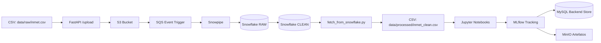

# Projeto: Pipeline de Ingestão, Processamento e Análise — Inmet + Snowflake + MLflow

## Visão Geral
Este repositório implementa uma arquitetura completa para ingestão, armazenamento, processamento e análise de dados meteorológicos do INMET.  
O fluxo principal é:

`data/raw/inmet.csv → FastAPI → S3 → SQS → Snowpipe → Snowflake (staging → clean) → data/processed/inmet_clean.csv`

Além disso, o ambiente de experimentação em Machine Learning utiliza:

`Jupyter → MLflow → MinIO (artefatos) → MySQL (backend store)`

A orquestração é feita com **Docker Compose**, e o script `pipeline.sh` automatiza todo o processo (upload, processamento e extração final).

---
## Estrutura do Repositório

```md
.
├── data
│   ├── processed/            # dados limpos exportados pelo Snowflake
│   └── raw/                  # arquivos CSV brutos para upload
│
├── fastapi_app/
│   ├── main.py               # endpoint POST /upload → envia CSV para S3
│   ├── Dockerfile
│   └── requirements.txt
│
├── jupyter_app/
│   ├── notebooks/
│   │   ├── exploracao.ipynb
│   │   └── modelagem.ipynb
│   ├── Dockerfile
│   └── requirements.txt
│
├── mlflow_app/
│   ├── Dockerfile
│   └── requirements.txt
│
├── scripts/
│   ├── pipeline.sh           # script, facilitar uso da solução
│   └── fetch_from_snowflake.py
│
├── docker-compose.yml
└── README.md


```

---

## Organização e Documentação
- **README.md**: orientar a execução e arquitetura do projeto.
- **data/raw**: arquivos brutos que serão enviados à API.
- **data/processed**: saída final extraída do Snowflake (camada clean).
- **scripts/**: automações de ingestão e extração.
- **fastapi_app**, **jupyter_app**, **mlflow_app**, **etc**: todos os serviços foram isolados via Docker.

---

## Requisitos
- Docker 
- Conta Snowflake com Storage Integration configurado
- Bucket S3 configurado para Snowpipe
- Credenciais no arquivo `.env` na raiz

---

## Configuração do Ambiente (.env)

Crie um arquivo `.env` na raiz:

```env
# AWS
AWS_ACCESS_KEY_ID=
AWS_SECRET_ACCESS_KEY=
AWS_DEFAULT_REGION=
S3_BUCKET=
S3_PATH=

# Snowflake
SNOWFLAKE_USER=
SNOWFLAKE_PASSWORD=
SNOWFLAKE_ACCOUNT=
SNOWFLAKE_WAREHOUSE=
SNOWFLAKE_DATABASE=
SNOWFLAKE_SCHEMA=
SNOWFLAKE_TABLE=

# Minio
MINIO_ROOT_USER=
MINIO_ROOT_PASSWORD=
MINIO_ACCESS_KEY_ID=
MINIO_SECRET_ACCESS_KEY=

# MySQL
MYSQL_ROOT_PASSWORD=
MYSQL_DATABASE=
MYSQL_USER=
MYSQL_PASSWORD=

# MlFlow endpint
MLFLOW_MINIO_ENDPOINT_URL=
MLFLOW_ARTIFACT_BUCKET=  
MLFLOW_BACKEND_URI=

````

**Importante:**

* Não comitar `.env`.
* Ajuste nomes de tabela e schema conforme seu S3 e Snowflake.

---

## Preparando os Dados (colocar CSV)

1. Adicione seu arquivo original na pasta:

   ```
   data/raw/inmet.csv
   ```

2. O FastAPI irá receber este arquivo e enviá-lo para o bucket S3.

---

## Executando a Pipeline

### 1) Executar o script principal

Toda a automação do pipeline é feita pelo script `pipeline.sh`.  
Na raiz do projeto, execute:

#### Com upload (FastAPI → S3 → Snowpipe → Snowflake → exportação):
```bash
cd scripts
bash pipeline.sh --upload
````

#### Sem upload (apenas inicializa os containers):

```bash
cd scripts
bash pipeline.sh
```

---

## O que o script faz

O `pipeline.sh` é responsável por:

1. **Subir todos os containers** utilizando `docker compose up -d`
2. **Validar a existência do arquivo `.env`** na raiz do projeto
3. Quando executado com `--upload`:

   * Aguarda o FastAPI iniciar (10s)
   * Envia o arquivo CSV presente em `data/raw/` para o FastAPI
     → o FastAPI encaminha o arquivo para o S3
   * Aguarda o Snowpipe processar o arquivo (10s)
     → arquivo carregado na camada **RAW**
     → Snowflake aplica o tratamento e gera a tabela **CLEAN**
   * Executa `fetch_from_snowflake.py` dentro do container `jupyter`
     → salva o resultado final em:

     ```
     data/processed/inmet_clean.csv
     ```
4. Quando executado **sem** `--upload`:

   * Sobe containers
   * Não envia novos arquivos
   * Não executa o fetch automaticamente

Ao final, o script finaliza com:

```
[DONE] Pipeline concluído!
```


## Script `fetch_from_snowflake.py`

Este script também utilizado pelo `pipeline.sh`:

* conecta ao Snowflake via credenciais do `.env`;
* lê a tabela `<SNOWFLAKE_TABLE_CLEAN>`;
* salva em:

```
data/processed/inmet_clean.csv
```

---

## Arquitetura (Mermaid)



---

## Observações sobre Docker

* Todos os serviços são isolados.
* O projeto é reproduzível em qualquer ambiente com Docker.
* Para logs:

```bash
docker compose logs fastapi_app
docker compose logs mlflow
docker compose logs jupyter
```

---

## Versionamento (GitHub)

Recomendações:

* Branch principal: `main`
* Branch de desenvolvimento: `dev`
* Branches de feature: `feature/<nome>`
* `.gitignore`: adicionar:

```
.env
data/
__pycache__/
*.pyc
*.ipynb_checkpoints
mlruns/
```

---

## Checklist Antes de Rodar

* [ ] Criar `.env`
* [ ] Inserir `data/raw/inmet.csv`
* [ ] Ter Docker instalado
* [ ] Executar pipeline com `bash pipeline.sh --upload`

---

## Debug & Troubleshooting

### FastAPI não responde

```
docker compose logs fastapi_app
```

### Snowpipe não processa

* Verifique S3 Integration
* Verifique permissões do stage
* Teste manualmente com:

  ```sql
  select * from table(information_schema.copy_history(...));
  ```

### MLflow não registra artefatos

* Verifique se o MinIO está acessível
* Cheque as credenciais MinIO no `.env`

---

## Licença


---

